<p align="center">
  
</p>

<h1 align="center">Kremis</h1>

<p align="center">
  <strong>Deterministic knowledge graph for AI that never hallucinates</strong>
</p>

<p align="center">
  A minimal, graph-based cognitive substrate in Rust.<br>
  Records, associates, retrieves — but never invents.
</p>

<p align="center">
  <a href="https://github.com/TyKolt/kremis/actions/workflows/ci.yml"></a>
  <a href="https://crates.io/crates/kremis-core"></a>
  <a href="https://kremis.mintlify.app"></a>
  <a href="https://dev.to/tykolt/i-spent-months-trying-to-stop-llm-hallucinations-prompt-engineering-wasnt-enough-so-i-wrote-a-4872"></a>
  <a href="LICENSE"></a>
  <a href="https://www.rust-lang.org/"></a>
  
</p>

> **Alpha** — Functional and tested. Breaking changes may still occur before v1.0.

<p align="center">
  
</p>

---

## Why Kremis

| Problem | How Kremis addresses it |
|---------|------------------------|
| **Hallucination** | Every result traces back to a real ingested signal. Missing data returns explicit "not found" — never fabricated |
| **Opacity** | Fully inspectable graph state. No hidden layers, no black box |
| **Lack of grounding** | Zero pre-loaded knowledge. All structure emerges from real signals, not assumptions |
| **Non-determinism** | Same input, same output. No randomness, no floating-point arithmetic in core |
| **Data loss** | ACID transactions via `redb` embedded database. Crash-safe by design |

> [Design Philosophy](https://kremis.mintlify.app/philosophy) — why these constraints exist.

---

## Features

- **Deterministic graph engine** — Pure Rust, no async in core, no floating-point. Same input always produces the same output
- **CLI + HTTP API + MCP bridge** — Three interfaces to the same engine: terminal, REST, and AI assistants
- **BLAKE3 hashing** — Cryptographic hash of the full graph state for integrity verification at any point
- **Canonical export (KREX)** — Deterministic binary snapshot for provenance, audit trails, and reproducibility
- **Zero baked-in knowledge** — Kremis starts empty. Every node comes from a real signal
- **ACID persistence** — Default `redb` backend with crash-safe transactions

---

## Use Cases

### AI agent memory via MCP

Give Claude, Cursor, or any MCP-compatible assistant a verifiable memory layer. Kremis stores facts as graph nodes — the agent queries them, and every answer traces back to a real data point. No embeddings, no probabilistic retrieval.

### LLM fact-checking

Ingest your data, let an LLM generate claims, then validate each claim against the graph. Kremis labels every statement as `[FACT]` or `[NOT IN GRAPH]` — no confidence scores, no ambiguity.

### Provenance and audit trail

Export the full graph as a deterministic binary snapshot, compute its BLAKE3 hash, and verify integrity at any point. Every node links to the signal that created it. Useful for compliance workflows where you need to prove what data was present and when.

---

## Honesty Demo

Ingest a few facts, let an LLM generate claims, and Kremis validates each one:

```
[FACT]          Alice is an engineer.              ← Kremis: "engineer"
[FACT]          Alice works on the Kremis project. ← Kremis: "Kremis"
[FACT]          Alice knows Bob.                   ← Kremis: "Bob"
[NOT IN GRAPH]  Alice holds a PhD from MIT.        ← Kremis: None
[NOT IN GRAPH]  Alice previously worked at DeepMind. ← Kremis: None
[NOT IN GRAPH]  Alice manages a team of 8.         ← Kremis: None

Confirmed by graph: 3/6
Not in graph:       3/6
```

Three facts grounded. Three fabricated. No ambiguity.

```bash
python examples/demo_honesty.py            # mock LLM (no external deps)
python examples/demo_honesty.py --ollama   # real LLM via Ollama
```

---

## Quick Start

Requires **Rust 1.89+** and Cargo.

```bash
git clone https://github.com/TyKolt/kremis.git
cd kremis
cargo build --release
cargo test --workspace
```

```bash
cargo run -p kremis -- init                                          # initialize database
cargo run -p kremis -- ingest -f examples/sample_signals.json -t json # ingest sample data
cargo run -p kremis -- server                                        # start HTTP server
```

In a second terminal:

```bash
curl http://localhost:8080/health
curl -X POST http://localhost:8080/query \
  -H "Content-Type: application/json" \
  -d '{"type":"lookup","entity_id":1}'
```

> **Note:** CLI commands and the HTTP server cannot run simultaneously (`redb` holds an exclusive lock). Stop the server before using CLI commands.

### Docker

```bash
docker build -t kremis .
docker run -d -p 8080:8080 -v kremis-data:/data kremis
```

---

## Architecture

| Component | Description |
|-----------|-------------|
| **kremis-core** | Deterministic graph engine (pure Rust, no async) |
| **apps/kremis** | HTTP server + CLI (tokio, axum, clap) |
| **apps/kremis-mcp** | MCP server bridge for AI assistants (rmcp, stdio) |

See the [architecture docs](https://kremis.mintlify.app/architecture) for internals: data flow, storage backends, algorithms, export formats.

---

## Documentation

Full reference at **[kremis.mintlify.app](https://kremis.mintlify.app)**:

| Topic | Link |
|-------|------|
| Introduction | [kremis.mintlify.app/introduction](https://kremis.mintlify.app/introduction) |
| Installation | [kremis.mintlify.app/installation](https://kremis.mintlify.app/installation) |
| Quick Start | [kremis.mintlify.app/quickstart](https://kremis.mintlify.app/quickstart) |
| Configuration | [kremis.mintlify.app/configuration](https://kremis.mintlify.app/configuration) |
| CLI Reference | [kremis.mintlify.app/cli/overview](https://kremis.mintlify.app/cli/overview) |
| API Reference | [kremis.mintlify.app/api/overview](https://kremis.mintlify.app/api/overview) |
| MCP Server | [kremis.mintlify.app/mcp/overview](https://kremis.mintlify.app/mcp/overview) |
| Philosophy | [kremis.mintlify.app/philosophy](https://kremis.mintlify.app/philosophy) |

---

## Testing

```bash
cargo test --workspace
cargo clippy --all-targets --all-features -- -D warnings
cargo fmt --all -- --check
```

---

<!-- BENCHMARK-START -->
## Benchmarks

> Auto-generated on CI runners — 2026-04-27.

| Operation | Linux | Windows | macOS |
|-----------|------:|------:|------:|
| Node insertion (100K) | 20.64 ms | 19.24 ms | 18.10 ms |
| Signal ingestion (10K batch) | 6.97 ms | 9.40 ms | 6.31 ms |
| Graph traversal (depth 50, 1K nodes) | 2.7 µs | 3.4 µs | 1.9 µs |
| Strongest path (1K nodes) | 7.6 µs | 9.1 µs | 5.8 µs |
| Canonical export (1K nodes) | 68.8 µs | 119.6 µs | 47.5 µs |
| Canonical import (10K nodes) | 3.07 ms | 3.55 ms | 3.28 ms |
| Redb node insertion (1K) | 358.92 ms | 9.6 s | 336.68 ms |
<!-- BENCHMARK-END -->

---

## License

[Apache License 2.0](LICENSE)

The brand assets in [`docs/logo/`](docs/logo/) (logo, icon, favicon) are proprietary and not covered by the Apache 2.0 license. See [`docs/logo/LICENSE`](docs/logo/LICENSE).

## Contributing

See [CONTRIBUTING.md](CONTRIBUTING.md) for guidelines. The architecture is still evolving — open an [issue](https://github.com/TyKolt/kremis/issues) before submitting a PR.

## Acknowledgments

This project was developed with AI assistance.

---

<p align="center">
  <strong>Keep it minimal. Keep it deterministic. Keep it grounded. Keep it honest.</strong>
</p>
